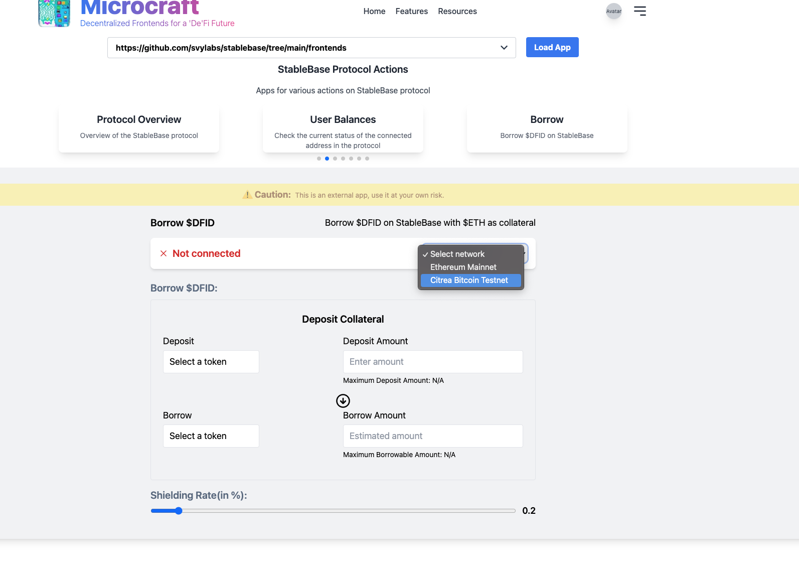
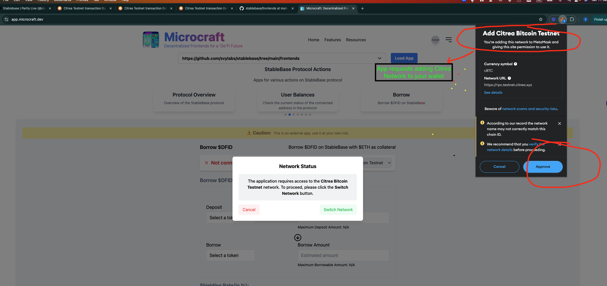
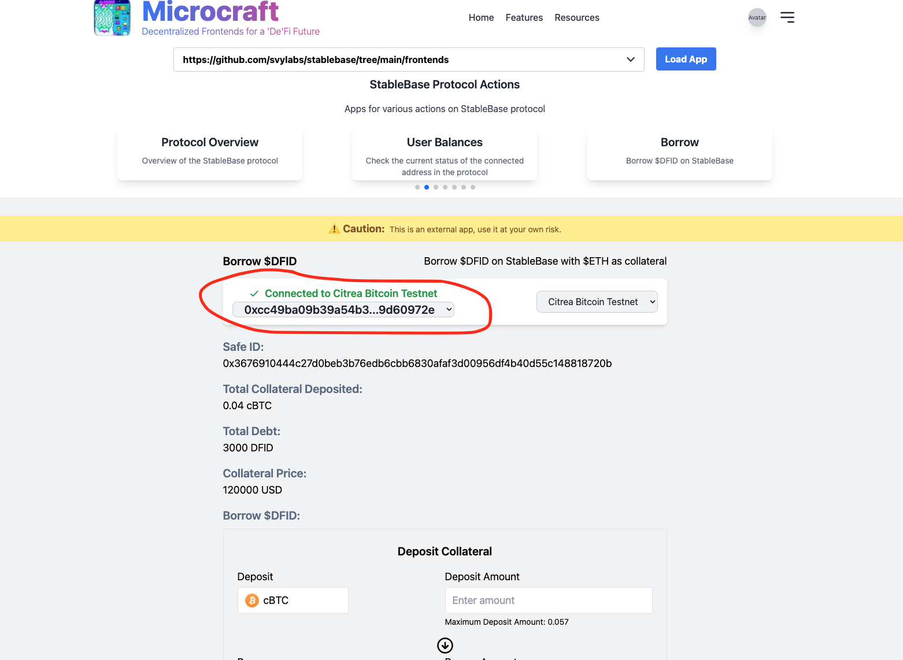
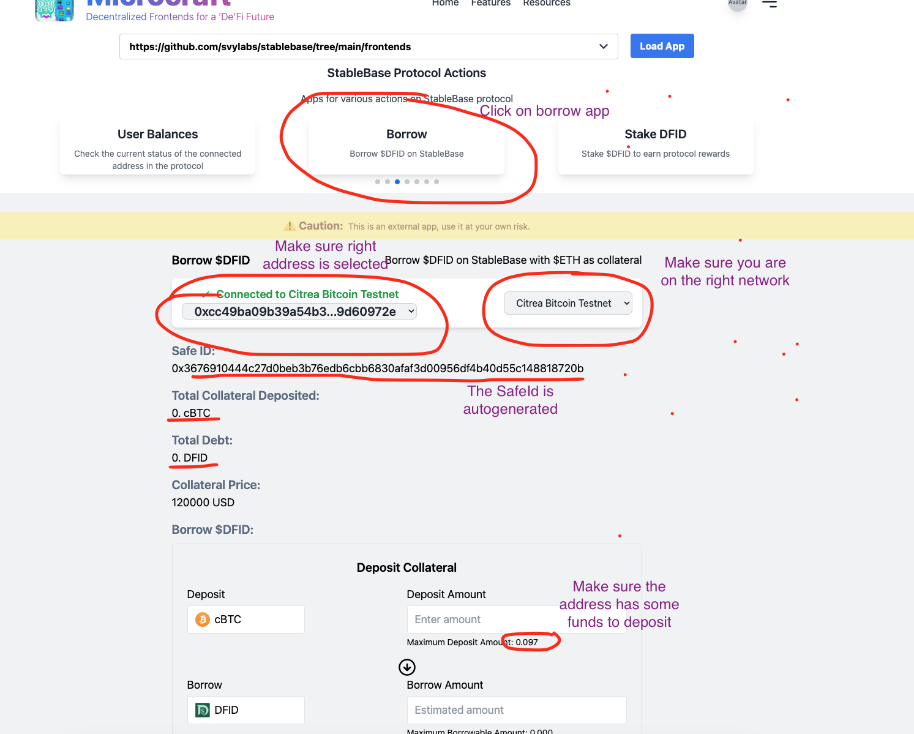
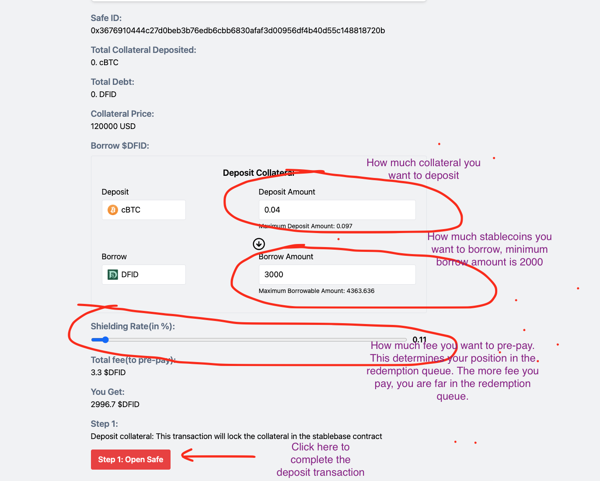
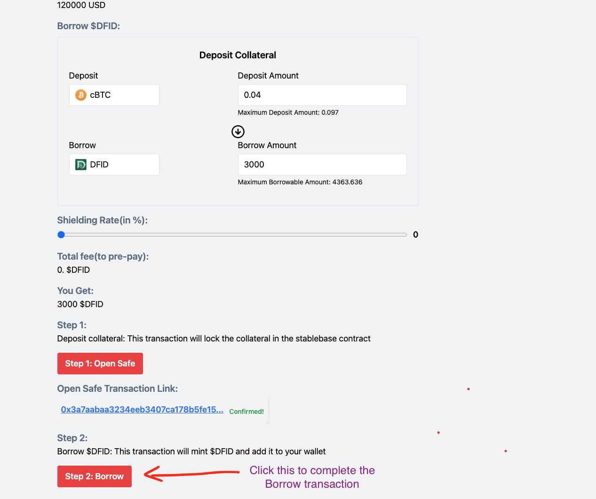

# Frontend Usage

StableBase frontends are developed using [Microcraft](https://app.microcraft.dev) framework, which is a JSON based UI definition framework, that supports inline Javascript. The framework also handles all the wallet and contract integrations.

This document describes how you can use the frontends.

# Opening the StableBase frontend

1. Open [https://app.microcraft.dev](https://app.microcraft.dev)
2. Enter `https://github.com/svylabs/stablebase/tree/main/frontends` in the text box and press `Load App`

# Connecting to network

1. Open one of the applications, for example: `borrow`

2. Select network

3. Allow app to connect to wallet(supports only Metamask for now)

4. Approve adding new network if needed

5. Connected

# Borrowing

1. Open the Borrow App

2. Make sure you are on the right network, right address, etc.

3. Enter total collateral amount to deposit, stablecoin amount to borrow, select a pre-paid fee, and click Open Safe

4. Click Borrow

